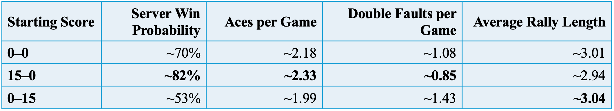

📌 Project Overview

🎯 Objectives

🎲 Simulation Design

### Simulation Results

The table below summarises the estimated server win probability and key performance measures produced by the simulation under different starting score conditions.

💻 Python Scripts

📊 Results

🧠 Skills Demonstrated

🚀 Future Improvements

📄 Report

🌍 About the Author
