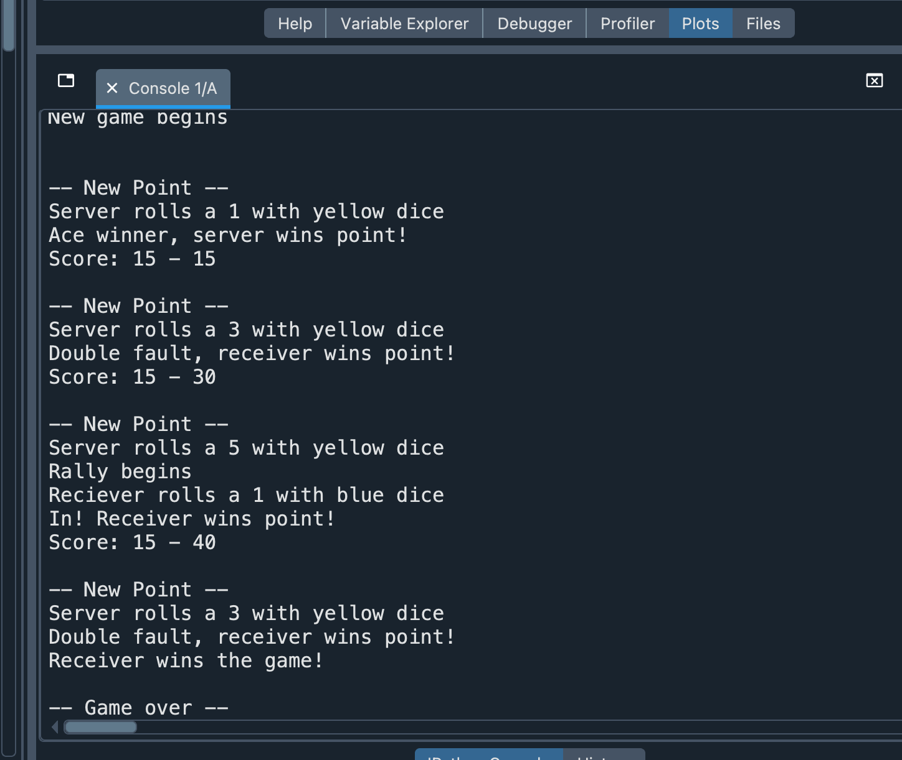

# 🎾 Slam Tennis Simulation

*A Python simulation of the Slam dice-based tennis game using probability, Monte Carlo simulation and performance analysis.*

## 📌 Project Overview

This project implements a Python simulation of **Slam**, a dice-based tennis game designed to model the scoring and mechanics of a tennis match through probabilistic simulation.

The simulation was developed incrementally, beginning with the implementation of a single point before extending to a complete game featuring authentic tennis scoring, including deuce and advantage. The model was then enhanced to estimate performance measures and investigate how different starting score conditions influence the probability of the server winning the game.

The project demonstrates how simulation can be used to explore sporting performance, evaluate probabilistic outcomes and support data-driven decision-making.

## 🎯 Objectives

- Simulate a complete game of Slam using Python.
- Implement realistic tennis scoring logic.
- Develop the solution using an incremental software design approach.
- Validate the implementation through systematic testing.
- Estimate performance measures using repeated simulation.
- Compare server win probabilities under different starting score conditions.
- Interpret simulation results from a coaching perspective.

## 🎲 Simulation Design

The simulation models each point using three six-sided dice that represent different stages of play:

- **Yellow dice** – determines the serve outcome.
- **Blue dice** – determines the receiver's return.
- **Red dice** – determines the server's response during the rally.

Each point contributes towards a complete tennis game following the traditional scoring sequence (0, 15, 30, 40, deuce and advantage).

### Sample Simulation Output

The example below illustrates a simulated game, showing the progression of individual points, score updates and the eventual winner.

## 🎲 Simulation Design
The simulation models a complete Slam game by generating dice outcomes, updating the score after each point and displaying the progression of the match.

## 💻 Python Scripts

The repository contains two Python implementations:

- **tennis_match_simulation.py** – the original implementation of the Slam tennis game.
- **tennis_match_simulation_modified.py** – an extended version that estimates performance measures and server win probabilities under different starting score conditions.

## 📊 Results

Repeated simulations were used to estimate the probability of the server winning and evaluate key performance measures.

The results demonstrate that:

- the server has the highest probability of winning when starting with a one-point advantage;
- beginning the game one point behind substantially reduces the server's chance of victory;
- average rally length remains relatively consistent across different starting conditions;
- serving performance, measured through aces and double faults, varies depending on the initial score.

### Simulation Results Summary

The table below summarises the estimated server win probability and performance measures under different starting score conditions.

## 🧠 Skills Demonstrated

- Python programming
- Simulation modelling
- Monte Carlo simulation
- Probability
- Algorithm design
- Software development
- Software testing
- Performance analysis
- Data interpretation

## 🚀 Future Improvements

Potential extensions include:

- Simulating complete tennis sets and matches.
- Introducing players with different ability levels.
- Modelling fatigue and momentum effects.
- Visualising results using statistical plots.
- Performing sensitivity analysis on serving probabilities.

## 📄 Report

The accompanying report explains the software design process, implementation decisions, testing strategy and interpretation of the simulation results.

📄 **Tennis_Match_Simulation_Report.pdf**

## 🌍 About the Author

Hi, I'm **Mia Emanuele**.

I'm a **Data Scientist** with a passion for statistical modelling, machine learning and explainable AI.

I enjoy **finding the "why" behind the data**—using data to uncover patterns, explain complex systems and support better decisions.

This repository forms part of my professional portfolio, showcasing projects completed during my MSc that have since been refined and expanded to demonstrate both technical expertise and analytical thinking.

### Connect with me

💼 LinkedIn: www.linkedin.com/in/mia-emanuele

💻 GitHub: https://github.com/miaemanuele77-ds

---

⭐ Thank you for taking the time to explore my work.

Feedback, discussion and collaboration are always welcome.
